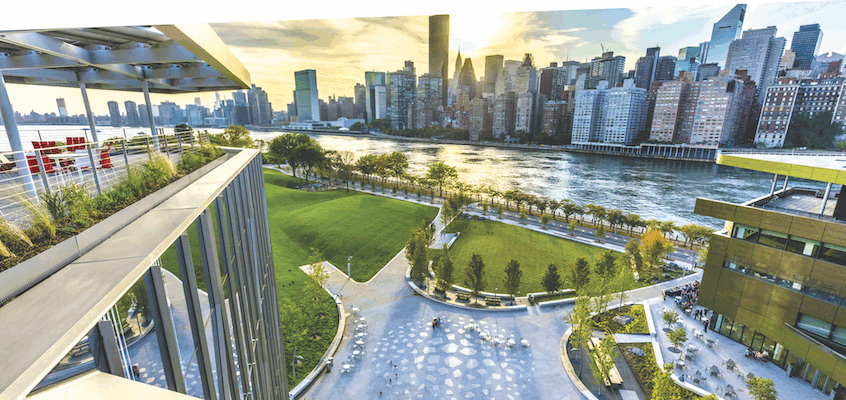

{{ 'welcome' | upcase }}

<img2 src="hub-drawing.png" alt="urban tech hub drawing"/>

# What is Urban Tech? {#what-is-urban-tech}
Urban Tech is the emerging interdisciplinary study of how to make cities and urban spaces more connected, livable, and efficient. Urban Tech encompasses the following domains:  clean-tech and sustainability, co-living and co-working, community management technology, construction-tech, property-tech, energy and utilities, logistics and delivery, mobility and transportation, smart cities and gov-tech.

# Dual Master’s Degree in Urban Tech {#ms-degree}
Our Technion-Cornell technical dual-degree program educates a new generation of software engineers, product managers, planners, decision-makers, etc. to realize the full utility of urban tech.

Our project-based, two-year curriculum centers on computer science and engineering and also draws on the disciplines of economics, sociology, entrepreneurship, and design.

The program provides exceptional preparation for myriad career paths in academia, industry, and the public sector that require a deep understanding of technology and its profound impact on cities and urban spaces.

[Apply here](http://apply.tech.cornell.edu){: .btn .btn--danger .btn--large .text-center}

# Recent Urban Tech Hub Activities {#other}

[New Day at the MTA conference](), 20 September 2019.
: The one-day event brings together leaders in technology, transportation-related industries, and academia to discuss innovative solutions that will drive the future of the Metropolitan Transportation Authority. 


[SMART CITIES NEW YORK (SCNY) conference](https://smartcitiesny.com), 13-15 May 2019.
: SCNY is North America's leading global conference for innovators and decision-makers who are improving life in the cities of tomorrow.
