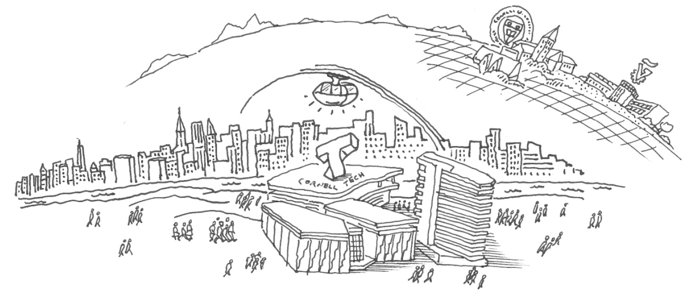

{{ 'welcome' | upcase }}

# About the Jacobs Technion-Cornell Institute at Cornell Tech {#about-jacobs}
The Jacobs Technion-Cornell Institute at Cornell Tech was founded as a joint academic venture between Cornell University and the Technion-Israel Institute of Technology to be a locus of academic experimentation and innovative approaches to research, entrepreneurship and education. The Jacobs Institute emphasizes a transdisciplinary view of science and encourages translational research that ultimately serves the worldwide common good, through a set of industry-focused “hubs” that address contemporary social and economic need around which research and academic programs are centered.

# What is Urban Tech? {#what-is-urban-tech}
Urban Tech is the emerging interdisciplinary study of how to make cities and urban spaces more connected, livable, and efficient. Urban Tech encompasses the following domains:  clean-tech and sustainability, co-living and co-working, community management technology, construction-tech, property-tech, energy and utilities, logistics and delivery, mobility and transportation, smart cities and gov-tech.

# Technion-Cornell Dual Master’s Degree in Urban Tech
Our technical, dual-degree program educates a new generation of software engineers, product managers, planners, decision-makers, etc. to realize the full utility of urban tech.

Our project-based, two-year curriculum centers on computer science and engineering and also draws on the disciplines of economics, sociology, entrepreneurship, and design.

The program provides exceptional preparation for myriad career paths in academia, industry, and the public sector that require a deep understanding of technology and its profound impact on cities and urban spaces.

<a href="http://apply.tech.cornell.edu">Apply here</a>.

# Team
<iframe class="airtable-embed" src="https://airtable.com/embed/shrGVliWT1g423ijc?backgroundColor=purple&layout=card" frameborder="0" onmousewheel="" width="100%" height="533" style="background: transparent; border: 1px solid #ccc;"></iframe>

# Other Urban Tech Activities
* [SMART CITIES NEW YORK (SCNY) conference](https://smartcitiesny.com), 13-15 May 2019.

SCNY is North America's leading global conference for innovators and decision-makers who are improving life in the cities of tomorrow.
* [The Future of the MTA conference](), 20 September 2019.
